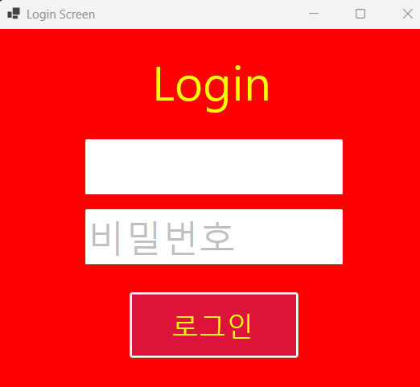
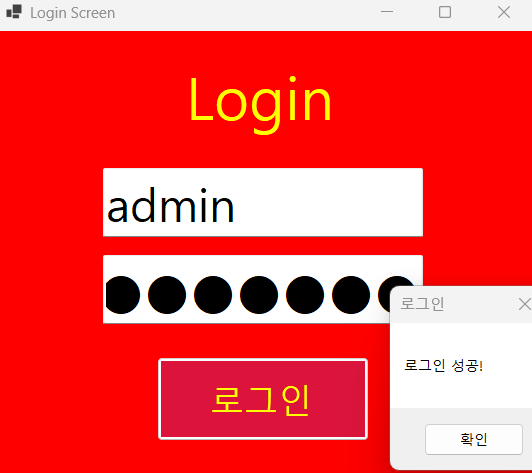
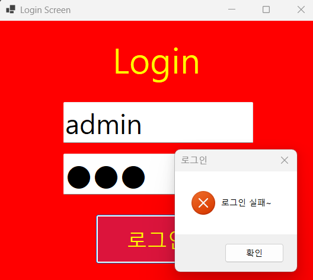

# (C# 코딩) 
	Login Screen
## 개요
	-C# 프로그래밍학습
	-1줄소개: 사용자에게 아이디와 비밀번호를 입력받아 로그인 기능을 구현하는 프로그램입니다.
	-사용한플랫폼: 
		-C#, .NET Windows Forms, Visual Studio, GitHub
	-사용한컨트롤:
		-Label, TextBox, Button
	-사용한기술과구현한기능: 
		- 로그인 화면 UI구현, Messagebox를 이용한 로그인 성공/실패 메시지 구현

## 실행화면(과제1)
-과제1코드의실행스크린샷

-과제내용

	-컨트롤배치와기본적인속성설정
	-Placeholder로입력창안내하는기능구현
	-아이디와패스워드처리기능구현
	

-구현내용과기능설명
	
	-컨트롤배치와기본적인속성설정: Label, TextBox, Button 컨트롤을 사용하여 로그인 화면의 UI를 구성하였습니다. Label은 "아이디"와 "패스워드"를 표시하고, TextBox는 사용자로부터 아이디와 패스워드를 입력받습니다. Button은 로그인 버튼으로 사용됩니다.
	
	-Placeholder로입력창안내하는기능구현: TextBox 컨트롤의 Placeholder 속성을 사용하여 사용자에게 입력해야 할 내용을 안내하는 기능을 구현하였습니다. 아이디 입력창에는 "아이디를 입력하세요", 패스워드 입력창에는 "패스워드를 입력하세요"라는 안내 문구가 표시됩니다.
	
	-아이디와패스워드처리기능구현: 로그인 버튼이 클릭되었을 때, TextBox에 입력된 아이디와 패스워드를 처리하는 기능을 구현하였습니다. 예시로, 아이디가 "admin"이고 패스워드가 "password"인 경우에만 로그인 성공 메시지를 표시하도록 하였습니다. 그 외의 경우에는 로그인 실패 메시지를 표시합니다.

	
## 실행화면(과제2)
-과제2코드의실행스크린샷

-과제내용
	
	
-구현내용과기능설명

	
## 실행화면(과제3)
-과제3코드의실행스크린샷

-과제내용
	
	
-구현내용과기능설명
	

## 실행화면(과제4)
-과제4코드의실행스크린샷

-과제내용
	
	
-구현내용과기능설명

	

